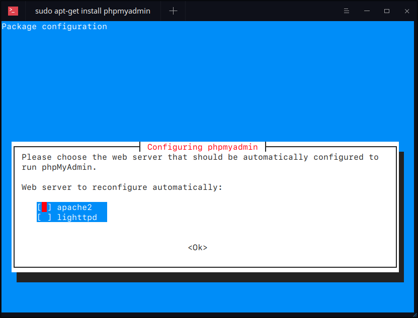
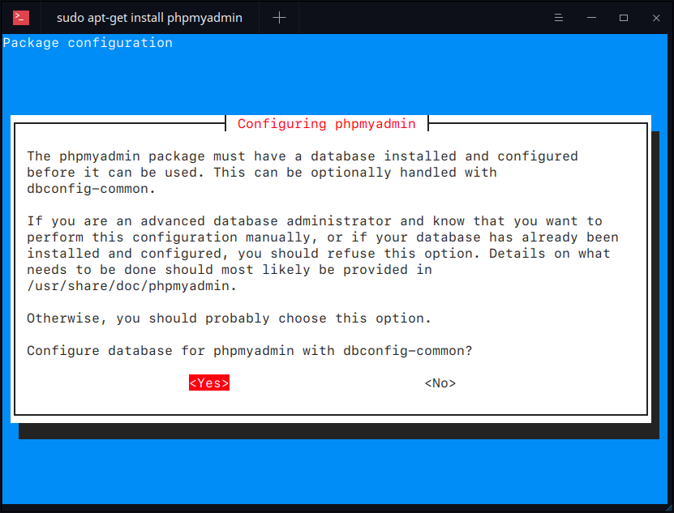
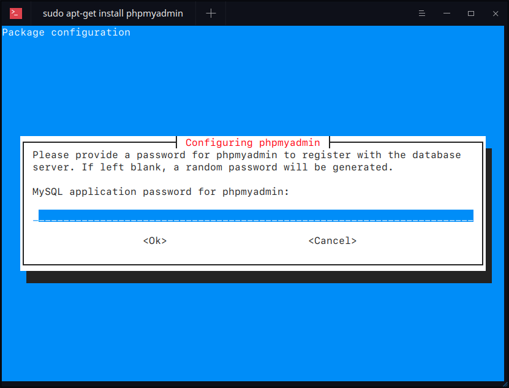
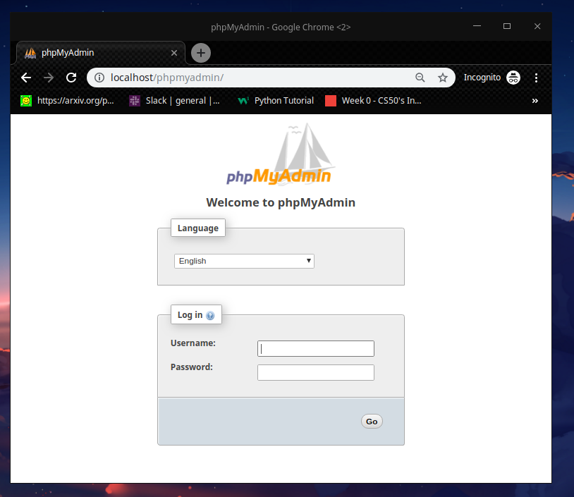
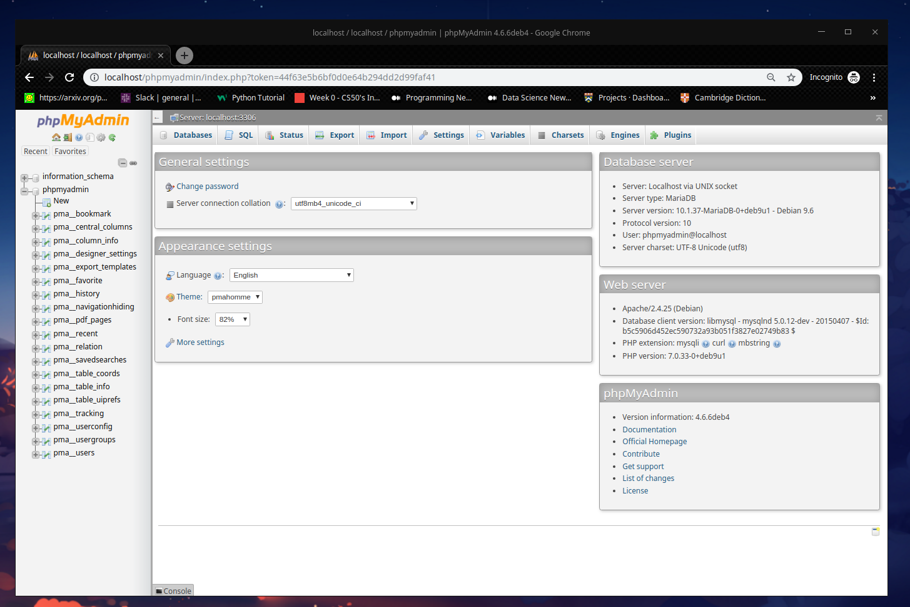

## [Install Ubuntu-Server on Virtual](https://linuxhint.com/install_ubuntu_virtualbox_2004/)

```bash
# Install virtual box:
# https://linuxhint.com/install_ubuntu_virtualbox_2004/

1 - Download virtual box from Oracle Virtualbox
2 - Install virtual box on your machine
3 - Download ubuntu-server
4 - Install ubuntu-server on virtual box.


# install virtual box on your machine
sudo apt install virtualbox
sudo apt install wget

# download ubuntu-server
wget -c http://releases.ubuntu.com/20.04/ubuntu-20.04.2-live-server-amd64.iso 

# Install ubunut server on vitual box
# https://www.techrepublic.com/article/how-to-install-ubuntu-server-20-04-with-the-new-live-installer/
```

### Setting Ubuntu-Server

```bash
# Before to starting the ubuntu server, let's to configure the network on the virtualbox
# for the ubuntu-server.

# Adapter

# First, starting Ubuntu-Server on the virtual machine

# terminal login and password

# type
$ ifconfig
enp0s3: flags=4163<UP,BROADCAST,RUNNING,MULTICAST>  mtu 1500
enp0s8: flags=4163<UP,BROADCAST,RUNNING,MULTICAST>  mtu 1500
lo: flags=73<UP,LOOPBACK,RUNNING>  mtu 65536

$ cat /etc/network/interfaces
auto lo
iface lo inet loopback

auto enp0s8
iface enp0s8 inet static
	address **********
	netmask **********

$ cat /etc/netplan/00-installer-config.yaml 
# This is the network config written by 'subiquity'
network:
  ethernets:
    enp0s3:
      dhcp4: yes
    enp0s8:
      dhcp4: no
      addresses: [**********/24]
  version: 2

sudo apt install ufw # firewall

sudo ufw enable

sudo ufw allow tcp/22
sudo ufw allow IP_ADDRESS

# From the host machine to access the VM
ssh username@ip_address_server

#https://linuxconfig.org/install-mysql-on-ubuntu-20-04-lts-linux

#https://linuxize.com/post/how-to-install-mariadb-on-ubuntu-20-04/

#https://linuxhint.com/install_mysql_ubuntu_2004/

#https://www.cyberciti.biz/faq/install-mysql-server-8-on-ubuntu-20-04-lts-linux/

```

## Server - Apache

```bash
'apache2' - Apache Hypertext Transfer Protocol Server
```

```bash
'apache2' is the Apache HyperText Transfer Protocol  (HTTP)  server  pro‐
       gram.  It  is  designed  to be run as a standalone daemon process. When
       used like this it will create a pool of child processes or  threads  to
       handle requests.

       In  general,  apache2 should not be invoked directly, but rather should
       be invoked via /etc/init.d/apache2 or apache2ctl.  The  default  Debian
       configuration  requires  environment  variables  that  are  defined  in
       /etc/apache2/envvars and  are  not  available  if  apache2  is  started
       directly.   However, apache2ctl can be used to pass arbitrary arguments
       to apache2.

```

## Installation

```bash
sudo apt-get update
sudo apt-get install apache2
sudo apt-get install mysql-server

```

```bash
sudo apt-get install phpmyadmin
```
Select ```apache2``` as the web server by pressing ```Space``` and then ```Tab``` key and press ```enter``` key. (```<Ok>```)



Press ```Yes``` to configure database for phpmyadmin.



Provide password which we set as ```root``` earlier.



Confirm it, and then you are done.

```bash
# Test phpMyAdmin
Now open 'http://localhost/phpmyadmin/' in your browser to access phpmyadmin and you can login with username and password both as root.

The requested URL /phpmyadmin/ was not found on this server.

Apache/2.4.25 (Debian) Server at localhost Port 80

########################################################
'WARNING': Does not work, BUT I know how to this!
#############################################################
```

## How to fix this: 

```bash
The requested URL /phpmyadmin/ was not found on this server.

## Please, see the steps below to fix this.
```

```bash
##################################
## Not Found
##################################
The requested URL /phpmyadmin/ was not found on this server.

Apache/2.4.25 (Debian) Server at localhost Port 80

'How to fix this:'

# First open the file apache2.conf
sudo -H gedit /etc/apache2/apache2.conf

# Second, add the line below in the end of the file 'apache2.conf'
Include /etc/phpmyadmin/apache.conf

# save and exit, done! go ahead.

# Third, restart apache, typing in the terminal
/etc/init.d/apache2 restart
[ ok ] Restarting apache2 (via systemctl): apache2.service.
```

### Localhost - Server
```bash
http://localhost/phpmyadmin/
```

```bash
# Now open again, 'http://localhost/phpmyadmin/' in your browser

# or type in terminal:
google-chrome http://localhost/phpmyadmin/

Fontconfig warning: "/etc/fonts/fonts.conf", line 100: unknown element "blank"
[6231:6231:0626/123242.111192:ERROR:sandbox_linux.cc(364)] InitializeSandbox() called with multiple threads in process gpu-process.
[6193:6213:0626/123242.246951:ERROR:browser_process_sub_thread.cc(209)] Waited 3 ms for network service
Opening in existing browser session.
```

Open the browser session, see below the login window in figure:



Enter with the ```Username``` and ```password```
```bash
Username: phpmyadmin
Password: **********
```



```bash
To check Apache Server Status and uptime in linux:
# Systemmctl Utility
sudo systemctl status apache2         
● apache2.service - The Apache HTTP Server
   Loaded: loaded (/lib/systemd/system/apache2.service; enabled; vendor prese
   Active: 'active' (running) since Sat 2021-06-26 12:30:26 -03; 49min ago
  Process: 5624 ExecStop=/usr/sbin/apachectl stop (code=exited, status=0/SUCC
  Process: 5631 ExecStart=/usr/sbin/apachectl start (code=exited, status=0/SU
 Main PID: 5652 (apache2)
    Tasks: 12 (limit: 4915)
   Memory: 56.8M
      CPU: 1.858s
   CGroup: /system.slice/apache2.service
           ├─ 5652 /usr/sbin/apache2 -k start
           ├─11999 /usr/sbin/apache2 -k start
           ├─12316 /usr/sbin/apache2 -k start
           ├─12319 /usr/sbin/apache2 -k start
           ├─12320 /usr/sbin/apache2 -k start
           ├─12327 /usr/sbin/apache2 -k start
           ├─14065 /usr/sbin/apache2 -k start
           ├─14072 /usr/sbin/apache2 -k start
           ├─14073 /usr/sbin/apache2 -k start
           ├─15090 /usr/sbin/apache2 -k start
           ├─15091 /usr/sbin/apache2 -k start
           └─15092 /usr/sbin/apache2 -k start

Jun 26 12:30:26 deepin systemd[1]: Starting The Apache HTTP Server...
Jun 26 12:30:26 deepin apachectl[5631]: AH00558: apache2: Could not reliably 
Jun 26 12:30:26 deepin systemd[1]: Started The Apache HTTP Server.
lines 1-26/26 (END)
```

### Server-Status

```bash
$ sudo cat /etc/apache2/mods-enabled/status.conf
<IfModule mod_status.c>
	# Allow server status reports generated by mod_status,
	# with the URL of http://servername/server-status
	# Uncomment and change the "192.0.2.0/24" to allow access from other hosts.

	<Location /server-status>
		SetHandler server-status
		Require local
		#Require ip 192.0.2.0/24
	</Location>

	# Keep track of extended status information for each request
	ExtendedStatus On

	# Determine if mod_status displays the first 63 characters of a request or
	# the last 63, assuming the request itself is greater than 63 chars.
	# Default: Off
	#SeeRequestTail On


	<IfModule mod_proxy.c>
		# Show Proxy LoadBalancer status in mod_status
		ProxyStatus On
	</IfModule>


</IfModule>

# vim: syntax=apache ts=4 sw=4 sts=4 sr noet
```


```bash
# Terminal type:
google-chrome http://localhost/server-status


Fontconfig warning: "/etc/fonts/fonts.conf", line 100: unknown element "blank"
[16456:16456:0626/132540.452421:ERROR:sandbox_linux.cc(364)] InitializeSandbox() called with multiple threads in process gpu-process.
[16416:16436:0626/132540.525900:ERROR:browser_process_sub_thread.cc(209)] Waited 3 ms for network service
Opening in existing browser session.

# In Browser you see:
Apache Server Status for localhost (via 127.0.0.1)
Server Version: Apache/2.4.25 (Debian)
Server MPM: prefork
Server Built: 2018-11-03T18:46:19
Current Time: Saturday, 26-Jun-2021 13:25:40 -03
Restart Time: Saturday, 26-Jun-2021 12:30:26 -03
Parent Server Config. Generation: 1
Parent Server MPM Generation: 0
Server uptime: 55 minutes 14 seconds
Server load: 1.99 3.05 3.06
Total accesses: 103 - Total Traffic: 1.6 MB
CPU Usage: u.54 s.21 cu0 cs0 - .0226% CPU load
.0311 requests/sec - 520 B/second - 16.4 kB/request
1 requests currently being processed, 10 idle workers
_W_________.....................................................
................................................................
......................
Scoreboard Key:
"_" Waiting for Connection, "S" Starting up, "R" Reading Request,
"W" Sending Reply, "K" Keepalive (read), "D" DNS Lookup,
"C" Closing connection, "L" Logging, "G" Gracefully finishing,
"I" Idle cleanup of worker, "." Open slot with no current process
Srv	PID	Acc	M	CPU	SS	Req	Conn	Child	Slot	Client	Protocol	VHost	Request
0-0	14065	0/0/6	_	0.02	325	29	0.0	0.00	0.16	127.0.0.1	http/1.1		
1-0	11999	0/2/14	W	0.00	0	0	0.0	0.01	0.15	127.0.0.1	http/1.1	127.0.1.1:80	GET /server-status HTTP/1.1
2-0	12316	0/1/7	_	0.00	420	10	0.0	0.01	0.13	127.0.0.1	http/1.1	127.0.1.1:80	GET /phpmyadmin/js/messages.php?lang=en&db=&token=cfa8a97dea32b
3-0	12327	0/0/7	_	0.15	325	5	0.0	0.00	0.10	127.0.0.1	http/1.1		
4-0	14072	0/0/10	_	0.06	325	47	0.0	0.00	0.06	127.0.0.1	http/1.1		
5-0	14073	0/0/5	_	0.00	325	43	0.0	0.00	0.02	127.0.0.1	http/1.1		
6-0	12319	0/18/35	_	0.12	372	0	0.0	0.44	0.88	127.0.0.1	http/1.1	127.0.1.1:80	GET /phpmyadmin/themes/pmahomme/img/sprites.png?v=4.6.6deb4 HTT
8-0	15090	0/0/18	_	0.40	347	6	0.0	0.00	0.14	127.0.0.1	http/1.1	127.0.1.1:80	GET /phpmyadmin/themes/pmahomme/img/s_asc.png HTTP/1.1
9-0	15091	0/0/1	_	0.00	346	201	0.0	0.00	0.00	127.0.0.1	http/1.1	127.0.1.1:80	POST /phpmyadmin/index.php HTTP/1.1
Srv	Child Server number - generation
PID	OS process ID
Acc	Number of accesses this connection / this child / this slot
M	Mode of operation
CPU	CPU usage, number of seconds
SS	Seconds since beginning of most recent request
Req	Milliseconds required to process most recent request
Conn	Kilobytes transferred this connection
Child	Megabytes transferred this child
Slot	Total megabytes transferred this slot
Apache/2.4.25 (Debian) Server at localhost Port 80
```

### ps Utility

**ps** is a utility which shows information concerning a selection of the active processes runing on a Linux system, you can use it with **grep command** to check Apache service uptime as follows.

```bash
ps -eo comm,etime,user | grep apache2
apache2            01:02:20 root
apache2               23:24 www-data
apache2               22:59 www-data
apache2               14:11 www-data
apache2               14:10 www-data
apache2               14:10 www-data
apache2               12:53 www-data
apache2               12:52 www-data
apache2               12:52 www-data

ps -eo comm,etime,user | grep root | grep apache2 
apache2            01:03:37 root
```
Here, the flags:

- ```-e``` - Enables selection of every processes on the system.
- ```-o``` - is used to specify output (comm,-- command, etime-- process execution time and user -- process owner).

```bash
ps -eo comm,etime,user | grep apache2
apache2            01:02:20 root
apache2               23:24 www-data
apache2               22:59 www-data
apache2               14:11 www-data
apache2               14:10 www-data
apache2               14:10 www-data
apache2               12:53 www-data
apache2               12:52 www-data
apache2               12:52 www-data

ps -eo comm,etime,user | grep root | grep apache2 
apache2            01:03:37 root
```

### To stop - Server

```bash
sudo systemctl status apache2                                                           1398ms 
● apache2.service - The Apache HTTP Server
   Loaded: loaded (/lib/systemd/system/apache2.service; enabled; vendor preset: enabled)
   Active: 'inactive' (dead) since Sat 2021-06-26 13:45:02 -03; 2s ago
  Process: 20899 ExecStop=/usr/sbin/apachectl stop (code=exited, status=0/SUCCESS)
  Process: 5631 ExecStart=/usr/sbin/apachectl start (code=exited, status=0/SUCCESS)
 Main PID: 5652 (code=exited, status=0/SUCCESS)
      CPU: 2.269s

Jun 26 12:30:26 deepin systemd[1]: Starting The Apache HTTP Server...
Jun 26 12:30:26 deepin apachectl[5631]: AH00558: apache2: Could not reliably determine the server'
Jun 26 12:30:26 deepin systemd[1]: Started The Apache HTTP Server.
Jun 26 13:45:01 deepin systemd[1]: Stopping The Apache HTTP Server...
Jun 26 13:45:02 deepin apachectl[20899]: AH00558: apache2: Could not reliably determine the server
Jun 26 13:45:02 deepin systemd[1]: Stopped The Apache HTTP Server.
```

### Start Apache Web Server

```bash
sudo systemctl start apache2

sudo systemctl status apache2
```

```bash
# After stop server and start again: ERROR
mysqli_real_connect(): (HY000/2002): No such file or directory


$ sudo /etc/init.d/mysql start
[ ok ] Starting mysql (via systemctl): mysql.service.
```

### [How To Create a Self-Signed SSL Certificate for Apache in Ubuntu 18.04](https://www.digitalocean.com/community/tutorials/how-to-create-a-self-signed-ssl-certificate-for-apache-in-ubuntu-18-04)

```bash
|Read the step-by-step: How To Create a Self-Signed SSL Certificate for Apache in Ubuntu 18.04
```

### Resources

- [Welcome! - The Apache HTTP Server Project](https://httpd.apache.org/)
- [Quickly setup a localhost environment in Ubuntu](https://blog.ashfame.com/2011/03/quickly-setup-localhost-environment-ubuntu/)
- [3 Ways to Check Apache Server Status and Uptime in Linux](https://www.tecmint.com/check-apache-httpd-status-and-uptime-in-linux/)
- [13 Apache Web Server Security and Hardening Tips](https://www.tecmint.com/apache-security-tips/)
- [How to Check Which Apache Modules are Enabled/Loaded in Linux](https://www.tecmint.com/check-apache-modules-enabled/)
- [5 Tips to Boost the Performance of Your Apache Web Server](https://www.tecmint.com/check-apache-modules-enabled/)
- [How to Password Protect Web Directories in Apache Using .htaccess File](https://www.tecmint.com/password-protect-apache-web-directories-using-htaccess/)
- [How To Create a Self-Signed SSL Certificate for Apache in Ubuntu 18.04](https://www.digitalocean.com/community/tutorials/how-to-create-a-self-signed-ssl-certificate-for-apache-in-ubuntu-18-04)
- [Ubuntu Server setup on Virtual box and connect with SSH](https://dev.to/shafikshaon/ubuntu-server-setup-on-virtual-box-and-connect-with-ssh-56k0)
- [How To Set Up a Firewall with UFW on Ubuntu 18.04](https://www.digitalocean.com/community/tutorials/how-to-set-up-a-firewall-with-ufw-on-ubuntu-18-04)